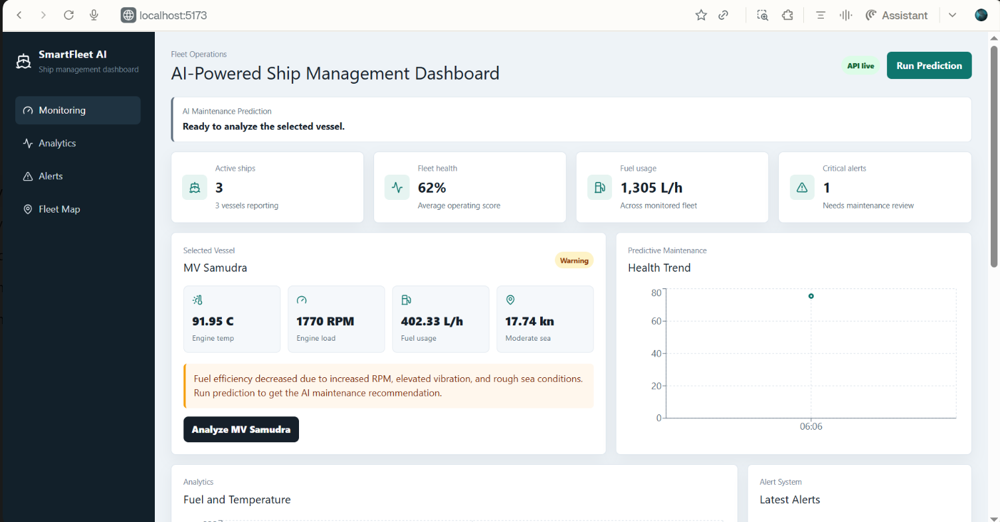
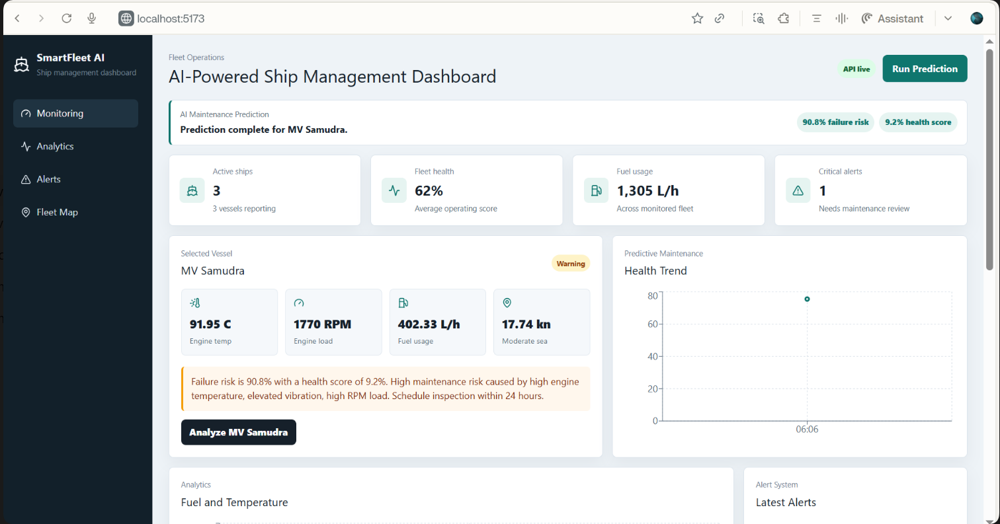
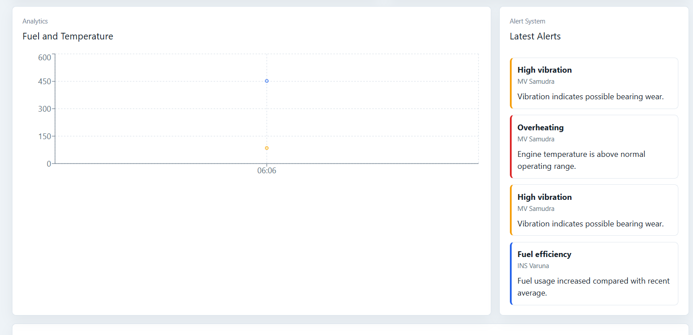

# AI-Powered Ship Management Dashboard

A full-stack fleet monitoring platform for predictive maintenance, alerts, analytics, and AI-assisted ship health insights using simulated ship telemetry.

## Modules

- `frontend/` - React, TypeScript, Tailwind dashboard
- `backend/` - Node.js and Express REST API
- `ai-service/` - Python FastAPI prediction service
- `database/` - PostgreSQL schema and seed data
- `docker/` - Docker compose for local services
- `docs/` - planning and architecture notes

## Features

- Live-style ship monitoring cards
- Fleet table with status, route, speed, RPM, temperature, and fuel usage
- Alert feed for overheating, vibration, and fuel inefficiency
- Charts for fuel, temperature, and health trends
- AI prediction endpoint for maintenance risk
- Simulated data so no real marine dataset is required
- PostgreSQL-backed backend with a telemetry simulation endpoint
- Scikit-learn based failure prediction and anomaly detection service

## Quick Start

### Option 1: Run with Docker

```bash
cd docker
docker compose up --build
```

Open:

- Frontend: `http://localhost:5173`
- Backend: `http://localhost:8000/health`
- AI service: `http://localhost:8001/health`

### Option 2: Run services manually

Install dependencies in each service:

```bash
cd frontend
npm install
npm run dev
```

```bash
cd backend
npm install
npm run dev
```

```bash
cd ai-service
python -m venv .venv
source .venv/bin/activate
pip install -r requirements.txt
uvicorn app.main:app --reload --port 8001
```

## API Overview

- `GET /ships`
- `GET /sensor-data`
- `GET /alerts`
- `POST /prediction`
- `POST /simulate`

## Demo Flow

1. Open the dashboard at `http://localhost:5173`.
2. Confirm the `API live` badge is visible.
3. Click `Run Prediction` to get an AI maintenance recommendation.
4. Send `POST http://localhost:8000/simulate` to insert a new telemetry cycle and possible alerts.
5. Refresh the dashboard to see updated fleet data.

## Environment Variables

Example environment files are included:

- `.env.example`
- `frontend/.env.example`
- `backend/.env.example`
- `ai-service/.env.example`

Copy the relevant example file to `.env` when running outside Docker.

## Screenshots

### Dashboard Overview



### AI Prediction Result



### Alerts and Analytics



## Project Goal

This project is designed as a polished final-year style portfolio project showing AI engineering, full-stack development, analytics, and industrial monitoring concepts.
