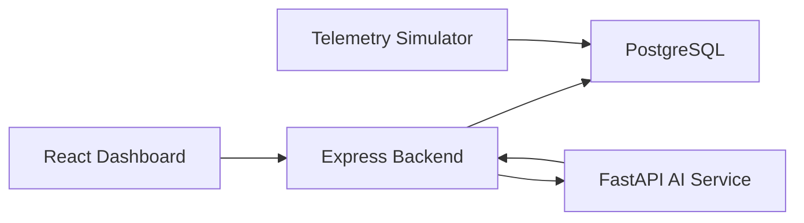

# Architecture

## Data Flow

1. Simulated telemetry creates realistic ship metrics.
2. Backend exposes fleet, sensor, alert, and prediction APIs.
3. AI service scores failure risk and anomaly status.
4. Frontend visualizes monitoring, trends, alerts, and insights.

## Main Entities

- Ship
- Sensor reading
- Alert
- Prediction
